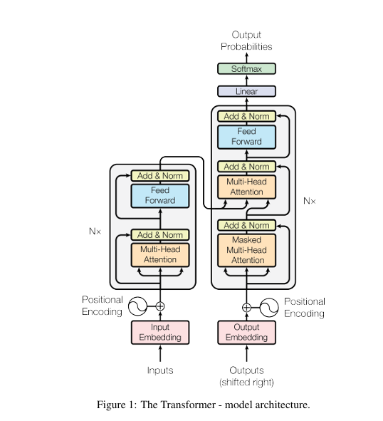

# Attentions is all you need summary

## Abstract
On abstract, this paper is saying it is a encoder decoder architecture, named `Transformer` which is much faster
and more accurate than normal RNN models. (They test it on an german to english translation task)

## Introduction
So here, they're saying that RNNs have an issue, which is each step `h_t` is dependent to `h_t - 1` and input of `t`
which is problematic for parallel calculations and also if we have a long sequence, on end of the sequence, if we want
to remember the context of the beginning of the sequence, we should have lot of parameters on our RNN layers. So on 
`Transformer` we can have a global attention between each input and output, so no need for huge RNN layers.

## Architecture

### Encoder:
As they mention, encoder is N stack of layers (which N is 6) and it includes
two sub layers (left side of the image) first is the multi head attention and second
is a simple fully connected positional wise feed forward. Also, both of them are followed
by a residual connection and a layer normalization. They mention to facilitate these residual
connections, all sub layers (including embeddings) will return dimension of 512

### Decoder:
Decoder is also an N layer stack (which N is 6). It has another sub layer in addition to 
the encoder layer, which is a masked multi head attention to the output of encoder. The reason
for masking, as they mentioned, is to prevent model to look forward positions for each i.
It's hard to explain, but it's like when we are predicting market candles, we shouldn't look in the future,
that's same here. I can understand the big picture, but how is that going to happen, I should first know about
input and outputs of each layer to be able to fully understand this.

### Attention:
So attention, as the paper is describing, is a mapping a query and a set of key-values
to an output. So what does that mean? It means you have a query vector, a key vector, and a
value vector. The output is weighted sum of the values, and what are the weights? It will compute by a
function of the query with its corresponding keys.

### Scaled Dot Product Attention: 
So this is the formula of scaled dot product attention, dk means dimension of keys and queries

### Multi head attention:

As the paper is saying, instead of using a large single attention, it's better to do `h` small attentions.
So we want each layer to return 512 dimension, so our `dmodel` is 512. si here because of that concatenate,
some of the attention outputs should be 512. So if `dk` = `dv` = `dmodel` / h. In this case `h` is 8.

### Applications of attention:
So on this paper, attention has applied in three ways (as shown on diagram as well).
1. The first attention, which is on beginning of the encoder layer, all keys, values, and queries are coming from 
previous layer (it's self attention)
2. Decoder first attentions is also a self attention, but it has a mask, what's that mask? So when we are training our 
model, the input of the decoder is the previous-extracted tokens. Let's have an example, imagine we are translating 
`How are you?` in persian, the input is `[<START>, How, are, you, ?, <END>]` and the output is 
`[<START>, حالت, چطوره, ?, <END>]`. So when we are training our model, We pass whole input sequences to the inputs, then,
on the first step, we will only pass `[<START>]` as the input of decoder, and `حالت` will be the 1st prob on Output prob. 
Then on second step, we will pass `[<START>, حالت]` 
as the decoder input and `چطوره` will be the 1st prob on outputs probs, and so on...
3. The last attention is the attention between the encoder and decoder, which the keys and values are coming from the
output of the encoder, and queries will come from previous layer on the decoder.

### Feed forward layers:
So on feed forward layers, paper is using two linear layers which are having a ReLU function between them, also the
output and the input of the layer are 512, but the hidden layers between them are 2048.

### Embeddings:
They use a normal learned embedding, but they don't tell which one they're using, also they mention they multiply 
embeddings by `sqrt(d_model)`

### Softmax:
They use a normal softmax with a linear layer before it, nothing special on this one.

### Positional encoding:
So because the model doesn't have any recurrence or convolutions, it will miss the knowledge behind the
positions, so in order of model to be able to have a positional understanding of tokens, they add sin/cos positional
encoding:

where pos is `position` and i is `dimension`